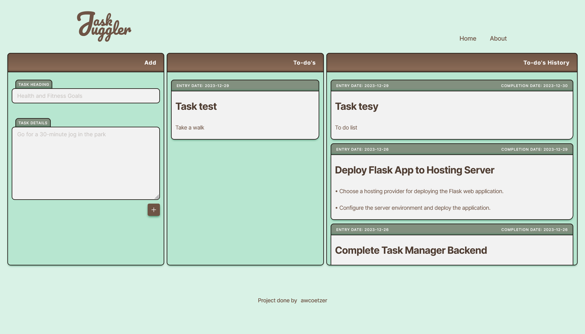

# TASK JUGGLER

#### <a href="https://cs50.harvard.edu/python/2022/project/" alt="CS50P's website">HARVARD | CS50P | FINAL PROJECT OUTLINE</a> 

#### LIVE SITE <a href="https://task-juggler.onrender.com">HERE</a>

 

#### DESCRIPTION
## What is the project all about?

Task Juggler is a Python-based task manager application designed for efficient task organization and management. Developed as the final project for Harvard's CS50P course, the application utilizes the Flask microframework to create a user-friendly web interface for handling tasks. Unlike traditional console-based task managers, Task Juggler offers a visually appealing and interactive platform for users to manage their to-do lists.

  
Read More

   

  

    Upon accessing the Task Juggler app, users are greeted with a straightforward interface that allows them to input a heading for their task, providing a quick way to categorize and organize their responsibilities. The app goes beyond simple text input by enabling users to provide detailed information about each task they enter.
  

  

    Once a task is added, Task Juggler stores it in a database, ensuring that users can access and manage their tasks seamlessly. The tasks are prominently displayed in the "todos" section, providing users with an easily accessible overview of their pending responsibilities.
  

  

    Task Juggler enhances task management by offering users the flexibility to either delete a task or mark it as completed. If a task is marked as complete, it is gracefully transitioned to the "history" section, accompanied by information such as the entry date and the completion date. This feature not only provides a historical record of completed tasks but also allows users to track their productivity over time.
  

  

    The decision to use Flask for the web framework reflects a strategic choice to explore and implement a modern and lightweight technology stack for web development. Flask's simplicity and flexibility align well with the project's objectives, allowing for a smooth integration of web functionality into the task management application.
  

  

    In summary, Task Juggler is a user-centric and visually engaging task manager that leverages the Flask microframework to create a dynamic web interface. It offers a comprehensive solution for entering, organizing, and tracking tasks, making it a valuable tool for individuals seeking an effective way to manage their to-do lists with a modern and accessible approach.
  

 

#### PROJECT SCREENS
## How the project looks

 

 

#### REQUIREMENTS & KNOWLEDGE
## This is what will be required to work on this project

- HTML
- CSS
- Python
- Flask Micro-Framework
- PIP
  - PIP Modules for installation
    - flask
    - python-dotenv
    - pymongo
    - gunicorn ( _To deploy to [render.com](https://render.com/)_ )
    - pytest & pytest-flask
- Built-in Modules
  - os
  - datetime
  - bson
    - from bson import ObjectId
- MongoDB
- Editor | _recommendation: <a href="https://code.visualstudio.com/" src="Visual Studio Code Website">Visual Studio Code</a>_

 

#### TREE & BLOBS
## Repository file & directory layout

- [assets/](./assets/)
  - [css/](./assets/css/)
    - [about.css](./assets/css/about.css)
    - [base.css](./assets/css/base.css)
    - [index.css](./assets/css/index.css)
  - [images/](./assets/images/)
    - [404/](./assets/images/404/)
    - [favicon/](./assets/images/favicon/)
    - [hero/](./assets/images/hero/)
    - [readme/](./assets/images/readme/)
  - [webmanifest/](./assets/webmanifest/)
- [templates/](./templates/)
  - [templates/](./templates/)
- [.env ( _ignored_ )](./.env)
- [.env.example](./.env.example)
- [.gitignore](./.gitignore)
- [app.py](./app.py)
- [README.md](./README.md)
- [requirements.txt](./requirements.txt)

 

#### PROJECT GOALS & STRETCH GOALS
## What needs to be done for the project

##### REQUIRED

- Your project must be implemented in Python
- Your project must have a main function and three or more additional functions. At least three of those additional functions must be accompanied by tests that can be executed with pytest.
  - Your main function must be in a file called project.py, which should be in the “root” (i.e., top-level folder) of your project.
  - Your 3 required custom functions other than main must also be in project.py and defined at the same indentation level as main (i.e., not nested under any classes or functions).
  - Your test functions must be in a file called test_project.py, which should also be in the “root” of your project. Be sure they have the same name as your custom functions, prepended with test_ (test_custom_function, for example, where custom_function is a function you’ve implemented in project.py).
  - You are welcome to implement additional classes and functions as you see fit beyond the minimum requirement.
- Implementing your project should entail more time and effort than is required by each of the course’s problem sets.
- Any pip-installable libraries that your project requires must be listed, one per line, in a file called requirements.txt in the root of your project.

 

#### SOURCES
## Links to Project Information and 3rd party tools used within the creation of this project

- Harvard Final Project
  - <a href="https://cs50.harvard.edu/python/2022/project/" alt="Link to the CS50P Final Project Page">Harvard Final Project Specifications</a>
- Image resizing & optimization
  - <a href="https://squoosh.app/" target="_blank" alt="A link to a website named Squoosh that helps for image file types and compression for better site optimization">squoosh.app</a>
- SVG optimization
  - <a href="https://svgomg.net/" alt="">svgomg.net</a>

 

#### CREDITS
## Those who worked on the project can be found below

- <a href="https://github.com/awcoetzer" alt="Link to awcoetzer Github profile">Andre W. Coetzer</a>